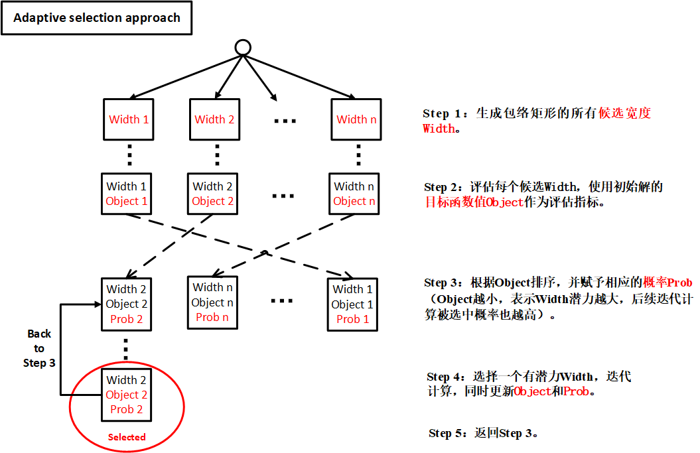
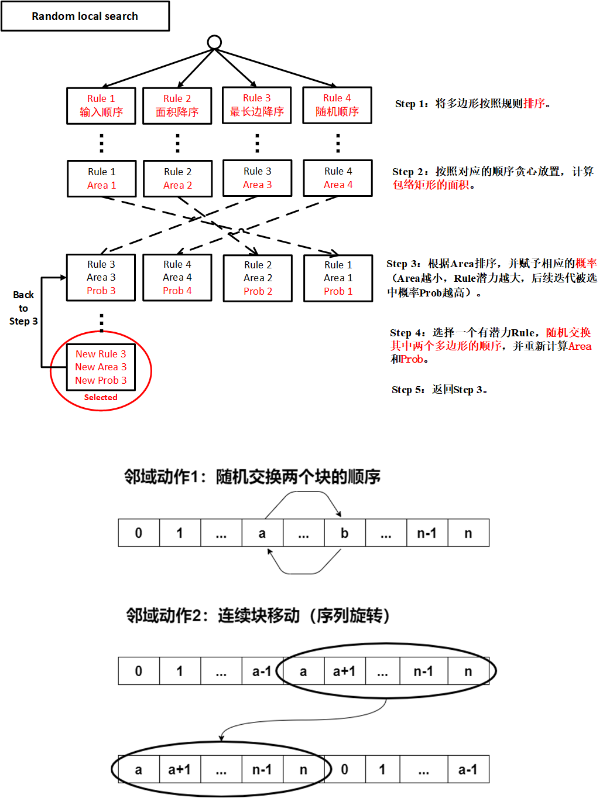

# SmartMPW

---

2020（第二届）集成电路EDA设计精英挑战赛

赛题三：**智能 MPW 拼接**

## 问题描述

输入 N 个不同形状和尺寸的多边形（相当于版图边界外形)，多边形为矩形或边均为正交方向的多边形（L字形、T字形、凹字形），要求输出各个多边形的最终摆放位置。目标函数为最小化拼接形成的包络矩形的面积，在面积相同的情况下，长宽比越接近 1 : 1 的矩形更优。

拼接规则为：

- 不允许重叠；
- 允许做基本的几何旋转；
- 拼接成的包络矩形需要满足长宽在一定范围内，如50um≤宽≤300um，50um≤长≤400um。

## 两层搜索框架

上层：**自适应选择搜索（ASA，Adaptive selection approach）** 的目标在于找到一个有潜力的包络矩形长度；

下层：**随机局部搜索（RLS，Random local search）** 则是为了找到一个合理的放置顺序。

 

## 算例求解情况

详见 [BestResult](Deploy/BestResult.md)。

## 排版效果展示

