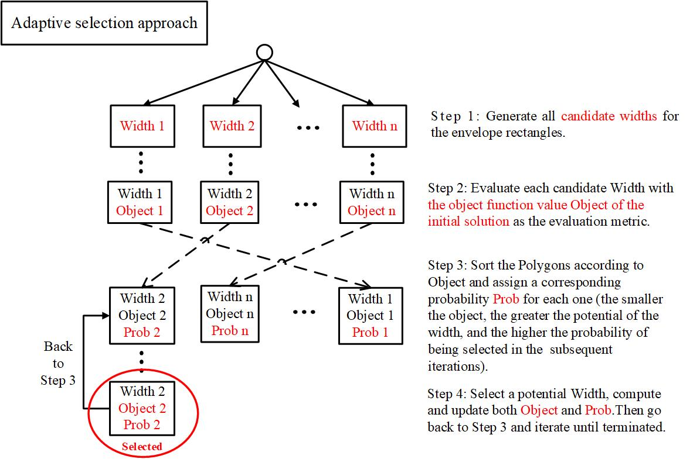
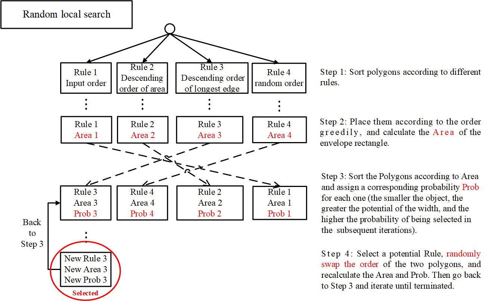
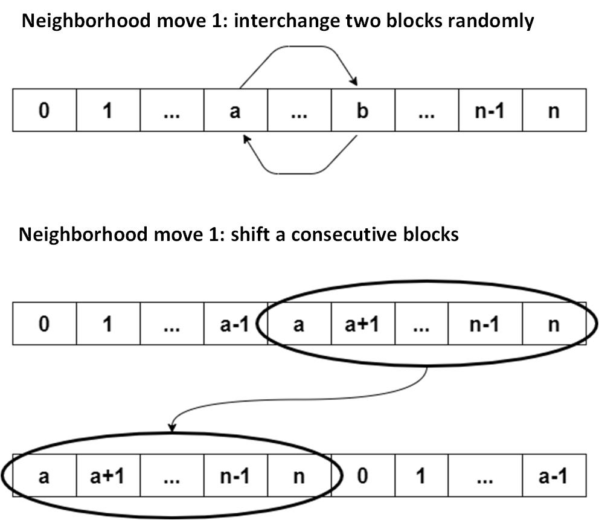

# SmartMPW

---

2020 (2nd) Integrated Circuit EDA Elite Challenge

Topic 3: **Intelligent MPW Splicing**

## Problem Description

The multi-project wafer problem (MPW) considered in this
paper is described as follows: Given a set of N polygons of different shapes and sizes, which is equivalent to layout boundary shape. The polygons are L/T/U-shaped rectilinear blocks and rectangular blocks. The final placement position of each polygon is required to be output. The objective is to minimize the area of the enveloping rectangle formed by abutting. In the case of the same area, the enveloping rectangle with a aspect ratio closer to 1:1 is better.

The abutting rules are as follows:

- Any of the two blocks are not overlapped.
- Basic geometric rotations are allowed.
- The length and width of the abutted envelope rectangle should be within a certain range, such as 50um ≤ width ≤ 300um, 50um ≤ length ≤ 400um.

## Two-layer Search Framework

Upper layer: **Adaptive selection approach (ASA)** is to find a potential envelope length.

Lower level: **Random local search (RLS)** is to find a reasonable placement order.

   

## Solution of Instances

see details in [BestResult](Deploy/BestResult.md)。

## Display of Layout Result

